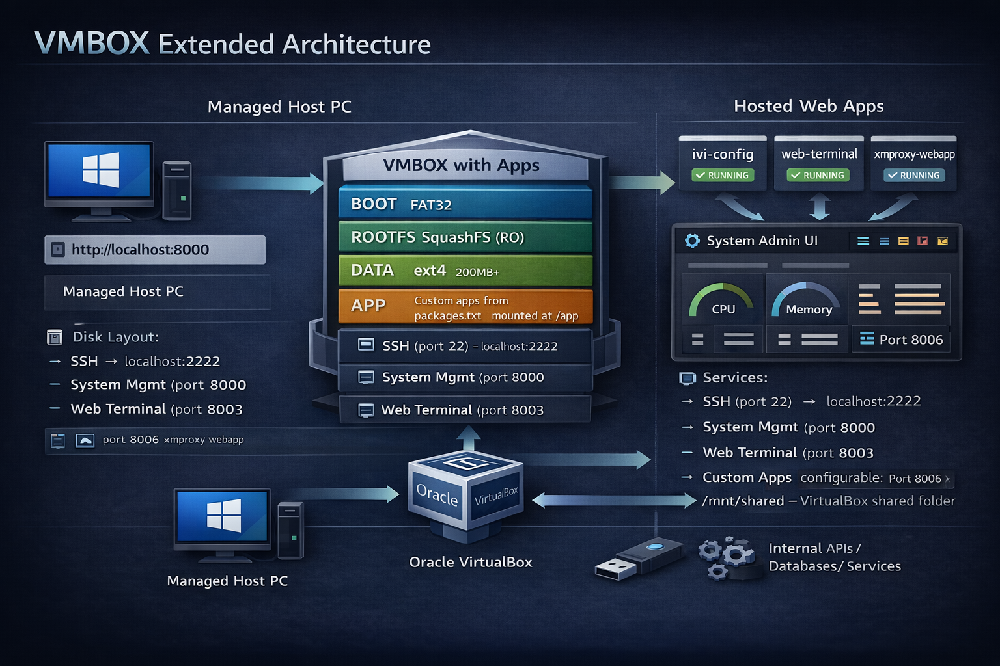

# VMBOX - VirtualBox-based Web Application Hosting Framework

A flexible build system for generating minimal Alpine Linux-based VirtualBox images. VMBOX can be deployed as a **base reference framework** or extended with **custom applications** packaged into a separate APP partition.



## Overview

VMBOX provides:
- **Immutable Root Filesystem**: SquashFS-based read-only rootfs with OverlayFS for runtime changes
- **Persistent Data**: Separate ext4 partition for user data, configurations, and overlay changes
- **Optional APP Partition**: SquashFS partition for deploying custom web apps and services
- **Factory Reset**: One-click reset to restore the system to its original state
- **System Management WebUI**: Real-time dashboard with CPU, memory, disk, network stats, and log viewer
- **Cross-Platform**: Export as OVA for use on Windows, macOS, or Linux
- **Minimal Footprint**: Based on Alpine Linux (~150MB compressed)

## Architecture

### Base Configuration (3-Partition)

Use this for a minimal reference system or when apps are bundled in rootfs:

```
┌─────────────────────────────────────────────────────────────────┐
│                           VMBOX (Base)                          │
├─────────────────────────────────────────────────────────────────┤
│  Disk Layout (MBR/BIOS)                                         │
│  ┌──────────┬────────────────────┬─────────────────────────┐    │
│  │ BOOT     │ ROOTFS             │ DATA                    │    │
│  │ (FAT32)  │ (SquashFS, ro)     │ (ext4, rw)              │    │
│  │ 64MB     │ 500MB              │ 200MB+                  │    │
│  │ syslinux │ Alpine + services  │ overlay, /var, /home    │    │
│  │ kernel   │                    │                         │    │
│  │ initramfs│                    │                         │    │
│  └──────────┴────────────────────┴─────────────────────────┘    │
│                                                                 │
│  Services:                                                      │
│  ├── SSH (port 22)           → localhost:2222                   │
│  └── System Mgmt (port 8000) → localhost:8000                   │
└─────────────────────────────────────────────────────────────────┘
```

### Extended Configuration (4-Partition with APP)

Use this for deploying custom web applications and backend services:

```
┌─────────────────────────────────────────────────────────────────────────┐
│                           VMBOX (with Apps)                             │
├─────────────────────────────────────────────────────────────────────────┤
│  Disk Layout (MBR/BIOS)                                                 │
│  ┌──────────┬──────────────┬──────────────┬────────────────────────┐    │
│  │ BOOT     │ ROOTFS       │ DATA         │ APP                    │    │
│  │ (FAT32)  │ (SquashFS)   │ (ext4, rw)   │ (SquashFS, ro)         │    │
│  │ 64MB     │ 500MB        │ 200MB        │ 200MB+                 │    │
│  │ syslinux │ Alpine +     │ overlay,     │ Custom apps from       │    │
│  │ kernel   │ base services│ /var, /home  │ packages.txt           │    │
│  │ initramfs│              │ app-data     │ mounted at /app        │    │
│  └──────────┴──────────────┴──────────────┴────────────────────────┘    │
│                                                                         │
│  Runtime Filesystem:                                                    │
│  /           → merged (squashfs lower + data/overlay upper)             │
│  /data       → DATA partition (direct mount)                            │
│  /app        → APP partition (read-only, custom applications)           │
│  /mnt/shared → VirtualBox shared folder                                 │
│                                                                         │
│  Services:                                                              │
│  ├── SSH (port 22)             → localhost:2222                         │
│  ├── System Mgmt (port 8000)   → localhost:8000                         │
│  ├── Web Terminal (port 8003)  → localhost:8003  [from APP partition]   │
│  └── Custom Apps (configurable)→ localhost:XXXX  [from APP partition]   │
└─────────────────────────────────────────────────────────────────────────┘
```

## Prerequisites

### Host System (Linux)

```bash
# Arch Linux
sudo pacman -S parted dosfstools e2fsprogs squashfs-tools syslinux virtualbox wget mtools socat jq

# Ubuntu/Debian
sudo apt install parted dosfstools e2fsprogs squashfs-tools syslinux virtualbox wget mtools socat jq
```

## Quick Start: Base Framework

Build a minimal VMBOX without custom applications:

```bash
# Clone the repository
git clone https://github.com/hackboxguy/vmbox.git
cd vmbox

# Build base rootfs
sudo ./build.sh --mode=base --output=/tmp/alpine-build --version=1.0.0

# Create disk image (3-partition: BOOT + ROOTFS + DATA)
sudo ./scripts/03-create-image.sh \
  --rootfs=/tmp/alpine-build/rootfs \
  --output=/tmp/alpine-build \
  --ospart=500M \
  --datapart=200M

# Fix ownership
sudo chown -R $(id -u):$(id -g) /tmp/alpine-build

# Convert to VirtualBox VM
./scripts/04-convert-to-vbox.sh \
  --input=/tmp/alpine-build/alpine-vbox.raw \
  --vmname=vmbox-base \
  --export-ova \
  --force

# Start the VM
VBoxManage startvm vmbox-base --type headless
```

After ~30 seconds, access http://localhost:8000 for the System Management WebUI.

## Extended Build: With Custom Applications

Build VMBOX with custom web applications packaged into the APP partition:

### Step 1: Clone Repository and Prepare Apps

```bash
# Clone VMBOX (with submodules)
git clone --recurse-submodules https://github.com/hackboxguy/vmbox.git
cd vmbox

# Or, if already cloned, initialize submodules:
git submodule update --init --recursive

# Clone additional apps into the apps/ folder as needed
cd apps/
git clone https://github.com/hackboxguy/web-terminal.git
cd ..
```

### Step 2: Configure packages.txt

Edit `packages.txt` to list all apps to be packaged:

```bash
vi packages.txt
```

Example `packages.txt` format:
```
# NAME|GIT_REPO|VERSION|CMAKE_OPTIONS|BUILD_DEPS|PORT|PRIORITY|TYPE|DESCRIPTION
web-terminal|file://./apps/web-terminal|HEAD||cmake|8003|10|webapp|Serial Console Web Terminal
```

### Step 3: Build Base Rootfs

```bash
sudo ./build.sh --mode=base --output=/tmp/alpine-build --version=1.0.1
```

### Step 4: Build APP Partition

```bash
sudo ./scripts/build-app-partition.sh \
  --packages=packages.txt \
  --output=/tmp/alpine-build/app \
  --rootfs=/tmp/alpine-build/rootfs
```

### Step 5: Create Disk Image with APP Partition

```bash
sudo ./scripts/03-create-image.sh \
  --rootfs=/tmp/alpine-build/rootfs \
  --output=/tmp/alpine-build \
  --ospart=500M \
  --datapart=200M \
  --apppart=200M \
  --appdir=/tmp/alpine-build/app/app
```

### Step 6: Fix Ownership

```bash
sudo chown -R $(id -u):$(id -g) /tmp/alpine-build
```

### Step 7: Convert to VirtualBox VM

```bash
./scripts/04-convert-to-vbox.sh \
  --input=/tmp/alpine-build/alpine-vbox.raw \
  --vmname=vmbox-apps \
  --appdir=/tmp/alpine-build/app/app \
  --usb=2 \
  --force
```

### Step 8: Export OVA (for Windows/macOS deployment)

```bash
VBoxManage export "vmbox-apps" -o "vmbox-apps.ova"
```

### Step 9: Start and Test

```bash
# Start VM (headless)
VBoxManage startvm vmbox-apps --type headless

# Wait ~45 seconds for boot, then access:
# - System Management: http://localhost:8000
# - Web Terminal: http://localhost:8003 (or via proxy at http://localhost:8000/app/web-terminal/)
```

## Accessing the VM

| Service | URL/Command |
|---------|-------------|
| SSH | `ssh -p 2222 admin@localhost` |
| System Management | http://localhost:8000 |
| Web Terminal | http://localhost:8003 |
| Custom Apps | Ports defined in packages.txt |

### Default Credentials

- **Username**: `admin`
- **Password**: `brb0x`

Used for SSH, serial console, and System Management WebUI.

### Changing Password

1. **Via Web UI**: Click "Change Password" in the Actions section
2. **Via SSH**: `passwd admin`

### Password Recovery

1. **Factory Reset**: Click Factory Reset in the WebUI (resets to default credentials)
2. **Reimport OVA**: Delete VM and reimport original OVA file

## Build Options

### build.sh

```bash
sudo ./build.sh \
    --mode=base \           # Build mode: base or incremental
    --output=/path/to/dir \ # Output directory
    --version=1.0.0 \       # Image version string
    [--hostname=vmbox] \    # VM hostname
    [--dev-mode] \          # Create writable rootfs (no squashfs)
    [--debug]               # Enable debug output
```

### 03-create-image.sh

```bash
sudo ./scripts/03-create-image.sh \
    --rootfs=/path/to/rootfs \  # Path to rootfs directory
    --output=/path/to/output \  # Output directory
    --ospart=500M \             # Root partition size
    --datapart=200M \           # Data partition size
    [--apppart=200M] \          # APP partition size (optional)
    [--appdir=/path/to/app]     # APP content directory (required if apppart set)
```

### 04-convert-to-vbox.sh

```bash
./scripts/04-convert-to-vbox.sh \
    --input=image.raw \     # Path to raw disk image
    --vmname=vmbox \        # VM name
    [--memory=1024] \       # RAM in MB (default: 1024)
    [--cpus=2] \            # CPU count (default: 2)
    [--appdir=/path] \      # APP directory for port forwarding
    [--usb] \               # Enable USB 2.0 passthrough
    [--usb=1|2|3] \         # USB version (1=OHCI, 2=EHCI, 3=xHCI)
    [--serial] \            # Enable serial console (Linux only)
    [--hostserial=/dev/X] \ # Pass through host serial port
    [--pcan] \              # Enable PCAN-USB adapter filter (VID 0c72)
    [--export-ova] \        # Export portable OVA file
    [--force]               # Overwrite existing VM
```

### build-app-partition.sh

```bash
sudo ./scripts/build-app-partition.sh \
    --packages=packages.txt \   # Package list file
    --output=/path/to/output \  # Output directory
    --rootfs=/path/to/rootfs \  # Rootfs for chroot builds
    [--git-token=TOKEN]         # Git token for private repos
```

The `--git-token` flag injects a `.netrc` credential file into the chroot so that
`git clone` can access private GitHub repositories during the build. The token is
removed automatically after the build completes. You can also set the `GIT_TOKEN`
environment variable instead:

```bash
export GIT_TOKEN=ghp_xxxxxxxxxxxx
sudo -E ./scripts/build-app-partition.sh --packages=packages.txt ...
```

## System Management WebUI

The built-in dashboard at http://localhost:8000 provides:


Features:

- **Real-time monitoring** via Server-Sent Events (1-second updates)
- **CPU/Memory/Disk gauges** with visual progress bars
- **Network statistics** (RX/TX traffic)
- **Applications panel** showing status of apps from /app partition
- **Log Viewer** with search, filtering, clear, and download features
- **Actions**: Change Password, Reboot, Factory Reset

### Log Management Features

- **Clear View**: Clear display only (log file unchanged)
- **Clear Log**: Truncate selected log file
- **Clear All**: Truncate all log files including kernel messages
- **Download All**: Download all logs as timestamped ZIP file

### API Endpoints

| Endpoint | Method | Description |
|----------|--------|-------------|
| `/login` | GET/POST | Authentication |
| `/logout` | GET | Clear session |
| `/api/stream` | GET | SSE real-time updates |
| `/api/system/info` | GET | All system information |
| `/api/apps` | GET | List applications from /app |
| `/api/logs/sources` | GET | Available log sources |
| `/api/logs/<id>` | GET | Get log content |
| `/api/logs/<id>/clear` | POST | Clear specific log |
| `/api/logs/clear-all` | POST | Clear all logs |
| `/api/logs/download` | GET | Download logs as ZIP |
| `/api/factory-reset` | POST | Reset to factory defaults |
| `/api/reboot` | POST | Reboot system |

## Directory Structure

```
vmbox/
├── build.sh                    # Main build orchestrator
├── config.sh                   # Default configuration values
├── Makefile                    # Lint and smoke-test targets
├── packages.txt                # App package list (for APP partition)
├── system-packages.txt         # System-level library dependencies
├── README.md                   # This file
│
├── scripts/
│   ├── lib.sh                  # Shared utility functions
│   ├── chroot-helper.sh        # Alpine chroot setup/teardown
│   ├── 01-create-alpine-rootfs.sh  # Create base Alpine rootfs
│   ├── 02-build-packages.sh    # Build apps from packages.txt
│   ├── build-app-partition.sh  # Create APP partition content
│   ├── 03-create-image.sh      # Assemble disk image
│   ├── 04-convert-to-vbox.sh   # Convert to VirtualBox VM
│   └── smoke-test.sh           # Build configuration validation
│
├── rootfs/                     # Files overlaid onto Alpine
│   ├── etc/
│   │   ├── init.d/             # OpenRC service scripts
│   │   └── conf.d/             # Service configurations
│   └── opt/
│       └── system-mgmt/        # System management webapp
│
├── apps/                       # Custom applications (git submodules or local)
│   ├── jsonrpc-tcp-srv/        # JSON-RPC XMPP Proxy (submodule)
│   └── xmproxy-webapp/         # XMPP Proxy Configuration (submodule)
│
└── initramfs/
    └── init                    # Custom init for overlay boot
```

## How It Works

### Boot Process

1. **BIOS** → Syslinux bootloader
2. **Syslinux** → Loads kernel + initramfs
3. **Initramfs** → Custom init script:
   - Mounts SquashFS rootfs (read-only)
   - Mounts ext4 data partition (read-write)
   - Mounts APP partition if present (read-only at /app)
   - Creates OverlayFS (merges rootfs + data/overlay)
   - `switch_root` to merged filesystem
4. **OpenRC** → Starts system services + app-manager (if APP partition exists)

### Factory Reset

Clears overlay and app data while preserving the base system:

```bash
# What happens during factory reset:
rm -rf /data/overlay/upper/*
rm -rf /data/overlay/work/*
rm -rf /data/app-data/*
rm -rf /data/app-config/*
reboot
```

## USB Serial Support

VMBOX can pass through USB serial adapters for web-based terminal access:

```bash
# Enable USB 2.0 with serial adapter filters
./scripts/04-convert-to-vbox.sh \
  --input=image.raw \
  --vmname=vmbox \
  --usb=2

# Supported adapters (auto-attached):
# - FTDI FT232/FT2232 (VID 0403)
# - Silicon Labs CP210x (VID 10C4)
# - WCH CH340/CH341 (VID 1A86)
# - Prolific PL2303 (VID 067B)
# - Arduino boards (VID 2341)

# Optional: enable PCAN-USB CAN bus adapter (VID 0C72)
./scripts/04-convert-to-vbox.sh \
  --input=image.raw \
  --vmname=vmbox \
  --usb=2 \
  --pcan
```

## VM Management

```bash
# Start VM
VBoxManage startvm vmbox --type headless

# Stop VM (graceful)
VBoxManage controlvm vmbox acpipowerbutton

# Force stop
VBoxManage controlvm vmbox poweroff

# Delete VM
VBoxManage unregistervm vmbox --delete

# Export to OVA
VBoxManage export vmbox -o vmbox.ova

# List running VMs
VBoxManage list runningvms
```

## Linting & Testing

A `Makefile` provides quick validation targets that do not require root or a full build:

```bash
make lint          # Run shellcheck + Python syntax check on core files
make smoke-test    # Validate packages.txt, system-packages.txt, and script syntax
make check         # Run lint + smoke-test
```

| Target | What it checks |
|--------|---------------|
| `lint-shell` | `shellcheck -S warning` on core build scripts |
| `lint-python` | `python3 -m py_compile` on core Python files |
| `smoke-test` | Field counts and URL format in `packages.txt` / `system-packages.txt`, `bash -n` on all scripts |

Install optional dependencies for full coverage:

```bash
# Arch Linux
sudo pacman -S shellcheck python

# Ubuntu/Debian
sudo apt install shellcheck python3
```

## Troubleshooting

### No network interface (only lo)

Ensure virtio network adapter:
```bash
VBoxManage modifyvm vmbox --nictype1 virtio
```

### USB devices not appearing in VM

1. Ensure VirtualBox Extension Pack is installed (for USB 2.0/3.0)
2. Add user to `vboxusers` group: `sudo usermod -aG vboxusers $USER`
3. Log out and back in

### Serial console on Windows

Serial console uses Unix sockets (Linux only). On Windows:
- Disable serial port in VM settings, or
- Use `--hostserial=COM1` for physical port passthrough

### VM won't start after OVA import on Windows

Disable serial port: VM Settings → Serial Ports → Uncheck "Enable Serial Port"

## License

GPL v2 License - See LICENSE file for details.
